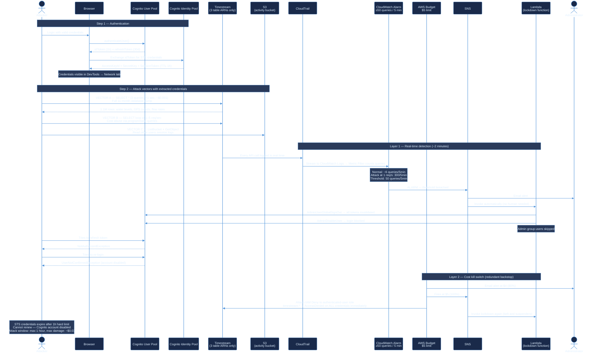

# IoT Monitoring System

<p align="center">
  
</p>

<p align="center">
  <strong>To be used in Water, Energy and any other smart city context.</strong><br/>
  Real-time AIIoT dashboards powered by Vue 3 · D3.js · AWS Timestream · AWS Cognito
</p>

<p align="center">
  
  
  
  
  
  
</p>

---

## Overview

**IoT Monitoring System** is an open-source, browser-native single-page application for real-time monitoring of IoT infrastructure across smart city domains — water distribution networks, energy grids, environmental sensors, and beyond.

It was designed to turn raw sensor data into actionable intelligence: live tank levels, pump flow rates, energy consumption trends, and anomaly alerts — all visualized through interactive D3.js charts without the need for a dedicated backend server.

Data flows directly from **AWS Timestream** to the browser using short-lived credentials issued by **AWS Cognito**, keeping the architecture serverless and cost-efficient.

**Live demo:** [https://igoralves1.github.io/sm-dashboard-client/](https://igoralves1.github.io/sm-dashboard-client/)

---

## Use Cases

This system is domain-agnostic. The same architecture and visualization layer can be applied to:

| Domain | Examples |
|---|---|
| 🌊 **Water** | Reservoir levels, pump flow rates, distribution pressure |
| ⚡ **Energy** | Consumption tracking, demand forecasting, grid efficiency |
| 🌡️ **Environment** | Air quality, temperature, humidity, rainfall |
| 🏙️ **Smart Cities** | Multi-sensor city dashboards, alert management |
| 🏗️ **Industrial IoT** | Equipment telemetry, predictive maintenance |

---

## Features

- **Animated liquid fill gauges** — D3.js water tanks with wave animation and color-coded threshold levels
- **Real-time time series** — 24-hour level and flow charts with threshold lines and interactive crosshair tooltips
- **Stacked area charts** — D3.js energy consumption trends with monthly projections and statistics
- **Donut charts** — Station status overview with interactive hover and SVG legends
- **Production bar charts** — Hourly and daily pump production grouped by sensor
- **Site map** — OpenStreetMap widget showing sensor locations with custom markers
- **AWS Cognito authentication** — 30-minute session tokens, silent refresh, forced password change on first login
- **Auto-refresh** — Configurable countdown timer with live data polling (default 5 min)
- **JSON snapshot export** — Timestamped logger with one-click export button
- **Fully responsive** — ResizeObserver-driven charts that adapt to any viewport

---

## Tech Stack

| Layer | Technology |
|---|---|
| Framework | Vue 3 + TypeScript + Vite |
| Charts | D3.js v7 |
| Map | Leaflet + OpenStreetMap |
| Auth | AWS Cognito User Pool (`amazon-cognito-identity-js`) |
| Data | AWS Timestream Query (`@aws-sdk/client-timestream-query`) |
| Credentials | AWS Cognito Identity Pool (`@aws-sdk/credential-provider-cognito-identity`) |
| UI | Bootstrap Vue Next |
| Deploy | GitHub Pages via GitHub Actions |

---

## Architecture

```
Browser
  │
  ├─ Cognito User Pool
  │    └─ Authenticates user, issues 30-min JWT tokens
  │
  ├─ Cognito Identity Pool
  │    └─ Exchanges JWT for temporary AWS credentials (STS)
  │
  └─ Timestream Query (direct browser → AWS, no backend needed)
       ├─ Real-time table  (latest sensor readings)
       ├─ Hourly table     (hourly aggregates)
       └─ Daily table      (daily aggregates)
```

No backend server. No API gateway. Sensor data goes directly from AWS to the browser.

---

## Project Structure

```
src/
├── assets/                  # Static assets (images, styles)
├── components/
│   └── charts/
│       ├── TankGauge.vue        # D3 animated liquid fill gauge
│       ├── LevelTimeSeries.vue  # Time series with thresholds & tooltip
│       ├── FlowTimeSeries.vue   # Multi-line PTP flow chart
│       ├── ProductionBar.vue    # Grouped bar chart (24h / daily)
│       ├── SiteMap.vue          # Leaflet map widget
│       └── RefreshCountdown.vue # D3 countdown arc timer
├── composables/
│   ├── useTimestreamDashboard.ts  # All Timestream queries & data fetching
│   └── useDashboardLogger.ts      # Snapshot logger & JSON export
├── stores/
│   └── auth.ts              # Pinia auth store (Cognito integration)
├── views/
│   ├── auth/                # Login & set-new-password pages
│   └── dashboards/
│       ├── dashboard/       # Main overview dashboard (stat cards, charts)
│       └── dashboard-sm/    # HidroForte SM IoT dashboard
└── router/
    └── index.ts             # Route definitions with silent token refresh
```

---

## Getting Started

### Prerequisites

- Node.js 18+
- AWS account with Cognito User Pool and Timestream configured

### Install & Run

```bash
git clone https://github.com/igoralves1/sm-dashboard-client.git
cd sm-dashboard-client
npm install
npm run dev
```

Open [http://localhost:5173/sm-dashboard-client/](http://localhost:5173/sm-dashboard-client/)

### Environment Variables

Copy `.env.example` to `.env` and fill in your AWS resource identifiers:

```bash
cp .env.example .env
```

All sensitive values are injected at build time via **GitHub Actions Secrets** and never committed to the repository. See `.env.example` for the full list.

```env
# AWS core
VITE_AWS_REGION=
VITE_USER_POOL_ID=
VITE_COGNITO_CLIENT_ID=
VITE_IDENTITY_POOL_ID=

# Timestream database
VITE_TIMESTREAM_DB=
VITE_TIMESTREAM_TABLE_RT=
VITE_TIMESTREAM_TABLE_HOURLY=
VITE_TIMESTREAM_TABLE_DAILY=

# S3 activity bucket
VITE_S3_ACTIVITY_BUCKET=

# Sensor end_id values
VITE_SENSOR_RAP_SIL=
VITE_SENSOR_PTP_01=
VITE_SENSOR_PTP_02=
VITE_SENSOR_PTP_03=
VITE_SENSOR_PTP_04=
VITE_SENSOR_RAP_MIR=
VITE_SENSOR_PTP_07=
```

> **GitHub Secrets:** go to *Settings → Secrets and variables → Actions* and add each variable above as a repository secret. The deploy workflow injects them automatically at build time.

### AWS Profile Setup

```bash
# Configure SSO (one-time setup)
aws configure sso --profile dev-sm

# Login when credentials expire (every 4h)
aws sso login --profile dev-sm
```

The profile auto-loads when you `cd` into this directory via [direnv](https://direnv.net/).

---

## CI/CD Pipeline

Automated build and deployment to GitHub Pages via **GitHub Actions** on every push to the `alle` branch.

```
Push to alle
     │
     ▼
┌──────────────────────┐
│   CI — Build         │  ubuntu-latest / Node.js 20
│                      │
│ 1. Checkout          │
│ 2. npm ci            │  Clean install
│ 3. Inject secrets    │  All VITE_* vars from GitHub Secrets
│ 4. Vite build        │  Secrets baked into /dist at compile time
└─────────┬────────────┘
          │
          ▼
┌──────────────────────┐
│  CD — Deploy         │
│                      │
│ 5. Upload dist       │  actions/upload-pages-artifact
│ 6. Deploy            │  actions/deploy-pages
└──────────────────────┘
          │
          ▼
  https://igoralves1.github.io/sm-dashboard-client/
```

No resource names, table names, sensor IDs, or bucket names are stored in the repository — all are injected from GitHub Secrets at build time.

---

## Authentication Flow

```
1. User visits /login
2. Enters email + password
3. Cognito User Pool authenticates
   ├─ First login → /new-password (forced password change)
   └─ Success    → JWT tokens stored in Pinia (access + id + refresh)
4. Access token valid for 30 minutes
5. On expiry → silent refresh via refresh token
6. On full expiry → redirect to /login
```

---

## Data Sources (AWS Timestream)

| Panel | Table | Measure |
|---|---|---|
| Tank gauge + Level chart | `RT` (real-time) | `water_level` |
| Flow PTPs | `RT` (real-time) | `flux` |
| Production 24h | `HOURLY` | `L_acc` |
| Production daily | `DAILY` | `L_acc` |

---

## Sensor Mapping

Sensor `end_id` values are configured via environment variables.
See `.env.example` for the full list of `VITE_SENSOR_*` variable names.

---

## Internationalization (i18n)

The application is fully bilingual — **English (EN)** and **Portuguese (PT)** — powered by [vue-i18n v9](https://vue-i18n.intlify.dev/) in Composition API mode.

### How locale is detected and stored

```
1. First visit
   └─ Calls ipapi.co to detect country by IP
      ├─ Brazil (BR) → PT
      └─ Anywhere else → EN
      Result cached in sessionStorage['prana_geo_v1']

2. User manually switches flag (EN ↔ PT)
   └─ Choice saved to localStorage['prana_locale_v1']
      Persists across browser sessions

3. On every page load
   └─ localStorage checked first → overrides IP detection
```

### Runtime reactivity

```
useLocale() composable
  └─ Module-level ref<Locale> (_locale)
       └─ main.ts watches it → syncs to i18n.global.locale.value
            └─ All t() calls in every component re-run instantly
```

### Locale files

```
src/locales/
├── en.json   ← English (default)
└── pt.json   ← Portuguese
```

Both files share identical key structure. Sections:

| Section | Covers |
|---|---|
| `nav` | Sidebar menu, section headers, user dropdown |
| `topbar` | Search, messages, notifications (all items + timestamps) |
| `login` | Sign-in page copy, feature pills, status bar |
| `new_password` | Forced password change page |
| `dashboard` | Stat cards, charts, alerts, stat model text |
| `monitoring` | Dashboard-SM page — IoT titles, chart labels, thresholds |
| `megamenu` | Top megamenu header and all link items |
| `data` | Timeline events, quarterly reports, project stats |
| `activity` | User activity page — all sections, labels, empty states |

### Adding a new translatable string

1. Add the key to **both** `en.json` and `pt.json`:
```json
// en.json
"my_section": {
  "my_key": "My English text"
}

// pt.json
"my_section": {
  "my_key": "Meu texto em português"
}
```

2. Use `t()` in the Vue component:
```vue
<script setup>
import { useI18n } from 'vue-i18n'
const { t } = useI18n()
</script>

<template>
  <p>{{ t('my_section.my_key') }}</p>
</template>
```

### D3.js charts and locale switching

D3 renders directly to the DOM — Vue template bindings do not apply to SVG text nodes. Every D3 chart that has translatable labels (axis labels, legend text) must redraw on locale change:

```ts
import { useI18n } from 'vue-i18n'
const { t, locale } = useI18n()

function draw() {
  // ...
  svg.append('text').text(t('monitoring.hour_of_day'))  // uses current locale
}

watch(locale, draw)  // redraw when user switches language
```

Components that follow this pattern: `LevelTimeSeries.vue`, `FlowTimeSeries.vue`, `ProductionBar.vue`, `DonutChart.vue`, `StackedAreaChart.vue`.

### Static data arrays with i18n

Arrays defined outside Vue components (e.g. in `data.ts`) cannot call `useI18n()`. Use getter functions that receive `t` as a parameter:

```ts
// data.ts
export function getStatCards(t: (k: string) => string): StatCard[] {
  return [
    { title: t('dashboard.active_sensors_card'), ... },
  ]
}

// component
import { computed } from 'vue'
import { useI18n } from 'vue-i18n'
import { getStatCards } from './data'

const { t } = useI18n()
const statCards = computed(() => getStatCards(t))
// computed re-runs automatically when locale changes
```

### Unit system

The locale also controls the measurement unit system:

| Locale | Water unit | Energy unit | Currency |
|---|---|---|---|
| `en` | `gal` | `kWh` | `US$` |
| `pt` | `m³` | `kWh` | `R$` |

Keys: `dashboard.water_unit`, `dashboard.energy_unit`.

---

## Security

This is an open-source repository. The frontend code is fully visible by design. However, the AWS backend is protected by multiple layers of automated guardrails — **no human intervention is required for any of them to activate**.

---

### Full security architecture diagram



---

### ⚠️ Notice to anyone attempting to misuse this system

The sections below describe in detail what is possible with extracted credentials, the exact token lifetimes, and why automated countermeasures make any attempt futile.

---

### Step 1 — What an attacker can extract from the browser

When a user authenticates, three tokens are issued and stored in `sessionStorage`:

| Token | TTL | Visible in browser? |
|---|---|---|
| `idToken` (Cognito JWT) | **1 hour** | ✅ Yes — Network tab, Authorization header |
| `accessToken` (Cognito JWT) | **1 hour** | ✅ Yes — Network tab |
| `refreshToken` | **30 days** | ✅ Yes — sessionStorage |
| STS `AccessKeyId` + `SecretAccessKey` + `SessionToken` | **1 hour hard limit** | ✅ Yes — Network tab, any HTTP proxy |

The STS credentials are the dangerous ones. They are standard AWS credentials that work outside the browser — in the AWS CLI, any SDK, or any script.

```bash
# What an attacker does after extracting credentials from DevTools:
export AWS_ACCESS_KEY_ID=ASIA...
export AWS_SECRET_ACCESS_KEY=...
export AWS_SESSION_TOKEN=...

aws timestream-query query --query-string "SELECT * FROM ..."
```

---

### Step 2 — Attack surface with extracted credentials

The IAM role assigned to authenticated users is scoped to the minimum required:

| Action | Resource | What the attacker can do | Impact |
|---|---|---|---|
| `timestream:Select` | 3 specific table ARNs only | Read sensor data (water levels, flow rates, GPS coords, device health) | 🟡 Medium — operational IoT data |
| `timestream:DescribeEndpoints` | `*` (AWS SDK requirement) | Resolve the regional endpoint | 🟢 None |
| `s3:PutObject` / `s3:GetObject` | activity bucket only | Read other users' session logs (emails, IPs, pages visited) | 🟡 Medium — privacy |
| `s3:ListBucket` | activity bucket only | List session log filenames | 🟢 Low |
| **Everything else** | — | `AccessDenied` | — |

**What is explicitly blocked:**

- ❌ No write to Timestream
- ❌ No `s3:DeleteObject` (removed)
- ❌ No access to any other S3 bucket in the account
- ❌ No `cognito-idp:ListUsers` (removed from this role)
- ❌ No IAM permissions
- ❌ No access to any other Timestream tables in the database
- ❌ No access to any other AWS service

**Potential attack vectors:**

```
VECTOR A — Data exfiltration (3 queries, < 1 second, cost ~$0.001)
  SELECT * FROM <realtime_table>          → sensor history (months of data)
  SELECT * FROM <hourly_table>            → hourly production aggregates
  SELECT * FROM <daily_table>             → daily production aggregates
  Result: complete database dump in seconds — no way to prevent this

VECTOR B — Cost abuse (SELECT loop, programmatic)
  Run SELECT in a tight loop at 1–5 req/sec using extracted STS keys
  Cost: $0.00038 per full table scan (37.9MB scanned, $0.01/GB)
  At 5 req/sec: theoretical $6.84/hour — kill switch fires before this

VECTOR C — S3 session log read
  ListBucket → enumerate all session files for all users
  GetObject  → read emails, IPs, pages visited, timestamps
  Cannot delete, cannot write to any other bucket
```

---

### Step 3 — Token TTLs and the exploitation window

```
T+0:00   Attacker extracts STS credentials from browser
T+0:00   STS credentials valid — attack begins
T+0:01   CloudTrail logs first Query API call (real-time)
T+0:05   CloudWatch Metric Filter evaluates first 5-min window
T+~2:00  ──► LAYER 1 FIRES if ≥50 queries detected in any 5-min window
              Lockdown Lambda executes:
              • AdminUserGlobalSignOut → refresh token invalidated
              • AdminDisableUser → re-login impossible
T+1:00   STS credentials expire (1-hour hard limit, non-renewable)
         Attacker cannot get new credentials (account disabled)
─────────────────────────────────────────────────────────────────
T+~8h    ──► LAYER 2 FIRES if spend reaches $5
              (AWS Budget checks ~3× per day as a redundant backstop)
              • IAM Deny policy attached → all timestream:* → AccessDenied
              • Lambda fires again (belt and suspenders)
```

**The exploitation window in practice:**

| Attack type | Window before lockdown | Max cost damage |
|---|---|---|
| Data exfiltration (3 queries) | Not stoppable — completes in < 1 second | ~$0.001 |
| Cost abuse loop at 1 req/sec | **~2 minutes** (Layer 1) | ~$0.03 |
| Cost abuse loop at 5 req/sec | **~2 minutes** (Layer 1) | ~$0.03 |
| Slow abuse below alarm threshold | Up to 1 hour (STS TTL) | ~$1.37 max |
| Re-login with same account after TTL | **Impossible** — account disabled | — |

The only vector with no automated prevention is a one-shot data exfiltration (Vector A) — 3 queries completing in under 1 second. The data exposed is IoT water sensor readings from two municipalities — operational data with no personal, financial, or credential information.

---

### Layer 1 — Real-time query rate detection

```
Every Timestream API call
  → AWS CloudTrail — permanent audit log
  → CloudWatch Logs — real-time stream, 30-day retention
  → CloudWatch Metric Filter (TimestreamQueryCount)
  → CloudWatch Alarm evaluates every 5 minutes

Normal app usage    →  ~6 queries per 5-min window  (refresh every 5 min)
Attack at 1 req/sec → 300 queries per 5-min window
Alarm threshold     →  50 queries per 5-min window

On ALARM:
  → SNS topic → Email to administrator
      └─ Lambda (lockdown function)
           ├─ Lists all users in the Cognito User Pool
           ├─ Skips users in 'admin' group (administrator unaffected)
           ├─ AdminUserGlobalSignOut → all refresh tokens invalidated
           └─ AdminDisableUser → accounts locked, re-login impossible
```

---

### Layer 2 — Cost kill switch (redundant backstop)

```
AWS Budget ($5/month limit on Timestream spend)

Spend reaches $4 (80%)  → Email alert to administrator
Spend reaches $5 (100%) → Two simultaneous automated actions:

  Action 1 — IAM Emergency Deny (Budget Action, automatic)
    Attaches emergency deny policy to the authenticated-user IAM role
    Effect: timestream:* → AccessDenied on ALL credentials
    Scope: Cognito pool users only — IoT rules, Grafana, Lambdas unaffected

  Action 2 — SNS → Lambda (same lockdown function as Layer 1)
    AdminUserGlobalSignOut + AdminDisableUser
    Belt-and-suspenders in case Layer 1 was somehow missed
```

---

### What is NOT affected by lockdown

| System | Why unaffected |
|---|---|
| IoT Core sensor ingestion (39 rules) | Uses `aws-iot-rule-*` roles — different IAM entirely |
| Grafana dashboards | Uses its own IAM credentials — different role |
| Scheduled Timestream queries | Uses `RoleTimestreamSchedule` — different role |
| Lambda functions | Each has its own execution role |
| Administrator account | Explicitly skipped by Lambda (`admin` Cognito group check) |
| Other Cognito pools in the account | Lambda scoped to this app's User Pool only |

The lockdown is surgically scoped to credentials issued by this app's Identity Pool — whether used from a browser, AWS CLI, Python script, or any other SDK. Nothing else in the AWS account is interrupted.

---

### Defense infrastructure — itemized monthly cost

This entire security stack runs permanently for **$0.61/month**:

| Component | Unit price | Monthly volume | Monthly cost |
|---|---|---|---|
| AWS CloudTrail trail | Free (first trail/region) | All management events | **$0.00** |
| CloudWatch Logs ingestion | $0.50/GB | ~935MB (IoT rules + Lambda + Timestream events) | **$0.48** |
| CloudWatch Logs storage | $0.03/GB/month | ~935MB × 30-day retention | **$0.03** |
| CloudWatch Metric Filter | Free | 1 filter | **$0.00** |
| CloudWatch Custom Metric | Free (first 10) | 1 metric | **$0.00** |
| CloudWatch Alarm | $0.10/alarm | 1 alarm | **$0.10** |
| SNS notifications | Free (first 1M/month) | < 100/month | **$0.00** |
| Lambda invocations | Free (first 1M/month) | < 10/month | **$0.00** |
| AWS Budget + Budget Action | Free (first 2 budgets) | 1 budget | **$0.00** |
| S3 (CloudTrail logs storage) | $0.023/GB | < 1GB/month | **$0.00** |
| **Total** | | | **$0.61/month** |

**The maximum financial damage an attacker can cause before automated lockdown fires is ~$0.03.** The defense costs more per month than a successful attack.

---

**Attempting to abuse this system is not worth the effort.**

---

## License

This is an open source project licensed under the **Apache 2.0 License**, developed by **Dr. Igor Lemos Alves**.
Free to be used by anyone.

The `alle` branch is a customization requested by **Prana** to adapt the project to its specific needs.

---

## References

- [biovisualize.com](https://www.biovisualize.com/) — D3.js visualization patterns and examples
- [Observable](https://observablehq.com/?utm_source=d3js-org&utm_medium=promo&utm_campaign=try-observable) — Interactive D3.js notebooks and chart examples
- [Observable — Trending](https://observablehq.com/trending) — Most popular notebooks right now
- [Observable — Recent](https://observablehq.com/recent) — Latest published notebooks
- [Observable — Top (recent)](https://observablehq.com/top?type=recent) — Top notebooks filtered by recent activity
- [Observable — Top](https://observablehq.com/top) — All-time top notebooks
- [Observable — Resource Center](https://observablehq.com/resource-center) — Tutorials, guides, and learning resources
- [Qualium Systems — Showcase](https://www.qualium-systems.com/showcase/) — Vue.js and frontend showcase examples
- [Piktochart — Big Data Visualization](https://piktochart.com/blog/big-data-visualization/) — Best practices and examples for visualizing large datasets

---
Last updated: 2026-06-08
