# AIoT Intelligent Asset Management Platform

<p align="center">
  <strong>From real-time monitoring to self-healing infrastructure — Water, Energy and any smart city context.</strong><br/>
  Real-time AIIoT dashboards powered by Vue 3 · D3.js · AWS Timestream · AWS Cognito · Open source (Apache 2.0)
</p>

<p align="center">
  
  
  
  
  
  
</p>

---

## Overview

This is an open-source **AIoT Intelligent Asset Management platform** — it combines real-time IoT monitoring (SCADA-style), statistical process control, and predictive maintenance into a single browser-native application for smart city infrastructure: water distribution networks, energy grids, environmental sensors, and beyond.

It is **not a CRM** — it manages *physical assets*, not customers. Think of it as a lightweight, serverless alternative to platforms like IBM Maximo or GE APM: it turns raw sensor data into actionable intelligence — live tank levels, pump flow rates, anomaly alerts with statistical p-values, auto-generated PDF reports — all visualized through interactive D3.js charts without a dedicated backend server.

Data flows directly from **AWS Timestream** to the browser using short-lived credentials issued by **AWS Cognito**, keeping the architecture serverless and cost-efficient.

**Live demo:** [https://igoralves1.github.io/sm-dashboard-client/](https://igoralves1.github.io/sm-dashboard-client/)

---

## Where We Are Now — and Where We're Going

### ✅ Today (implemented)

The platform currently operates as a full **real-time monitoring and statistical alerting system**, deployed in production for water supply infrastructure in Silvanópolis and Miranorte (Tocantins, Brazil):

- Live telemetry dashboards — tank gauges, level/flow time series, production bars
- Statistical Process Control — control charts (±3σ), box plots, Six Sigma anomaly detection with p-values
- Real-time alarms feed with severity classification and 20-page auto-generated PDF reports
- AWS Cognito authentication, role-based access, user activity auditing
- Fully serverless — browser queries AWS Timestream directly, zero backend
- Four languages (EN / PT / ES / FR), fully responsive, automated CI/CD to GitHub Pages

### 🔭 Vision (roadmap — not yet implemented)

The next evolution turns the platform from a system that *detects* problems into one that *resolves* them autonomously — **prescriptive maintenance**:

| Phase | Capability |
|---|---|
| **1. Notification & escalation** | Asset failure triggers automatic email notifications to field technicians; dedicated interaction channels for engineering, business teams, and stakeholders — each with role-appropriate views of the same incident |
| **2. Asset lifecycle management** | Registry of physical assets (pumps, sensors, valves) with maintenance schedules, rotation plans, and wear models — replacement needs known *before* failure |
| **3. Autonomous supply chain** | When a part is failing or due for rotation, the system contacts the supplier and requests delivery automatically — the procurement loop closes itself, with spend guardrails and full audit trail |
| **4. Self-healing operations** | The guiding principle: *by the time a manager becomes aware of an issue, the fix is already in place.* Incident reports arrive with the resolution attached |

These phases require a backend layer (event-driven workflows, email, supplier integrations) that will be built on the existing AWS foundation. Contributions and ideas are welcome — this is an open project.

---

## Use Cases

This system is domain-agnostic. The same architecture and visualization layer can be applied to:

| Domain | Examples |
|---|---|
| 🌊 **Water** | Reservoir levels, pump flow rates, distribution pressure |
| ⚡ **Energy** | Consumption tracking, demand forecasting, grid efficiency |
| 🌡️ **Environment** | Air quality, temperature, humidity, rainfall |
| 🏙️ **Smart Cities** | Multi-sensor city dashboards, alert management |
| 🏗️ **Industrial IoT** | Equipment telemetry, predictive maintenance |

---

## Features

- **Animated liquid fill gauges** — D3.js water tanks with wave animation and color-coded threshold levels
- **Real-time time series** — 24-hour level and flow charts with threshold lines and interactive crosshair tooltips
- **Stacked area charts** — D3.js energy consumption trends with monthly projections and statistics
- **Donut charts** — Station status overview with interactive hover and SVG legends
- **Production bar charts** — Hourly and daily pump production grouped by sensor
- **Site map** — OpenStreetMap widget showing sensor locations with custom markers
- **AWS Cognito authentication** — 30-minute session tokens, silent refresh, forced password change on first login
- **Auto-refresh** — Configurable countdown timer with live data polling (default 5 min)
- **JSON snapshot export** — Timestamped logger with one-click export button
- **Fully responsive** — ResizeObserver-driven charts that adapt to any viewport

---

## Feature Gallery

> Screenshots from a live deployment monitoring water supply systems in Silvanópolis and Miranorte, State of Tocantins, Brazil. This deployment is branded **prana** — the first client customization of the platform (the `prana` branch). The core software is brand-agnostic.

---

### 🔐 Login — prana AIIoT Platform

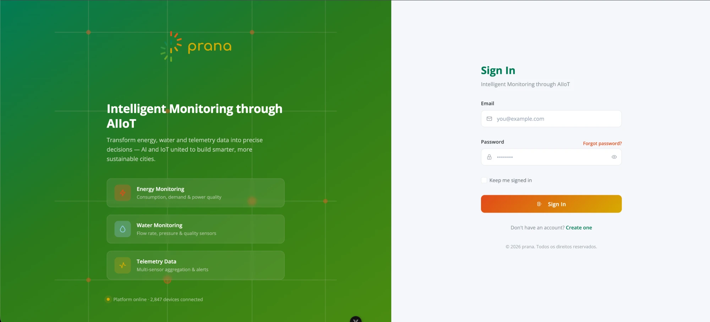

Secure sign-in page with AWS Cognito authentication. Supports forced password change on first login, silent token refresh every 30 minutes, and locale-aware interface (EN / PT / ES / FR). The hero panel highlights the platform's three monitoring domains: Energy, Water, and Telemetry.

---

### 🗺️ Full Dashboard — Real-Time Overview

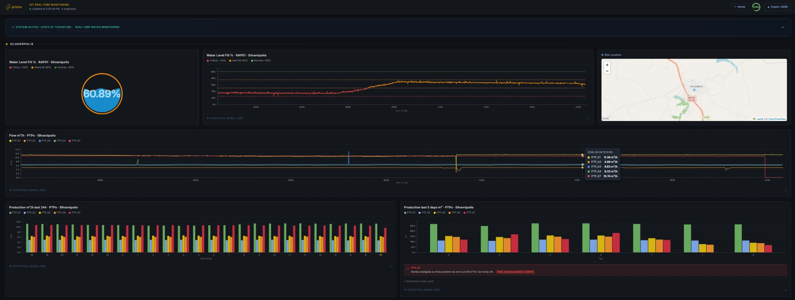

Bird's-eye view of the complete monitoring dashboard. All sections are visible simultaneously: the Silvanópolis reservoir gauge, level time series, site map, pump flow chart, hourly and daily production bars — all auto-refreshing every 5 minutes.

---

### 🧭 Dashboard Header — Branding, Countdown & Export

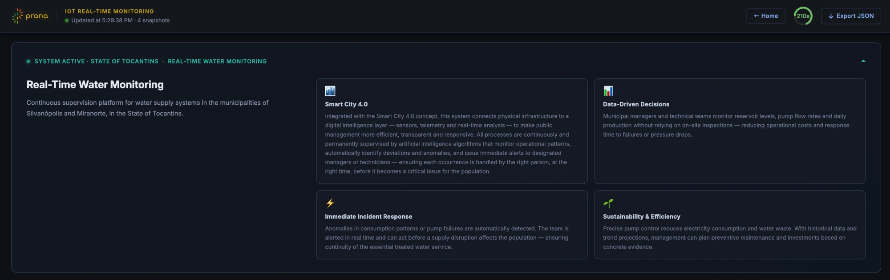

Top bar with the prana logo, live "Updated at" timestamp, a D3-animated countdown arc (210 s remaining), and an **Export JSON** button that downloads a full timestamped snapshot of all chart data. The info panel below the header summarises the system's Smart City 4.0 capabilities.

---

### 💧 Silvanópolis Section — Tank · Level Series · Map

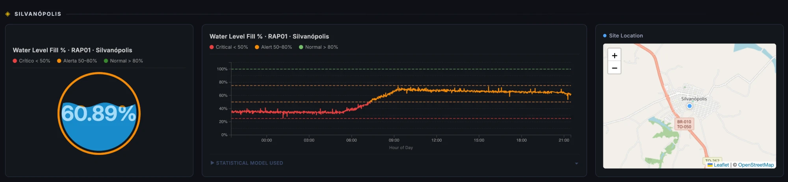

The primary monitoring row for Silvanópolis: an animated **liquid fill gauge** showing 60.89% reservoir level (orange = Alert 50–80%), a **24-hour level time series** with colour-coded threshold bands, and an **OpenStreetMap widget** pinning the RAP01 sensor site.

---

### 📈 Water Level Time Series + Control Chart

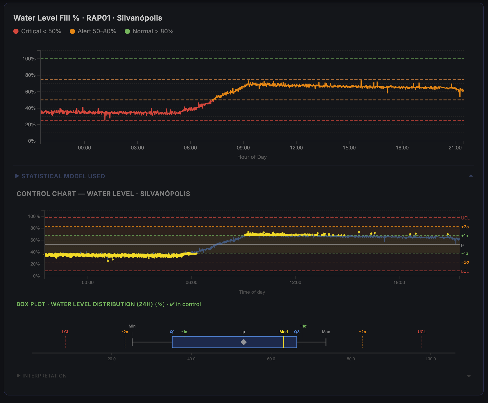

Expandable **Statistical Model** panel beneath the time series. The control chart overlays ±1σ, ±2σ and UCL/LCL bands; individual readings are shown as dots coloured by threshold zone. The chart transitions seamlessly from red (critical) to orange (alert) as the reservoir fills overnight.

---

### 📦 Control Chart + Box Plot — Water Level Distribution

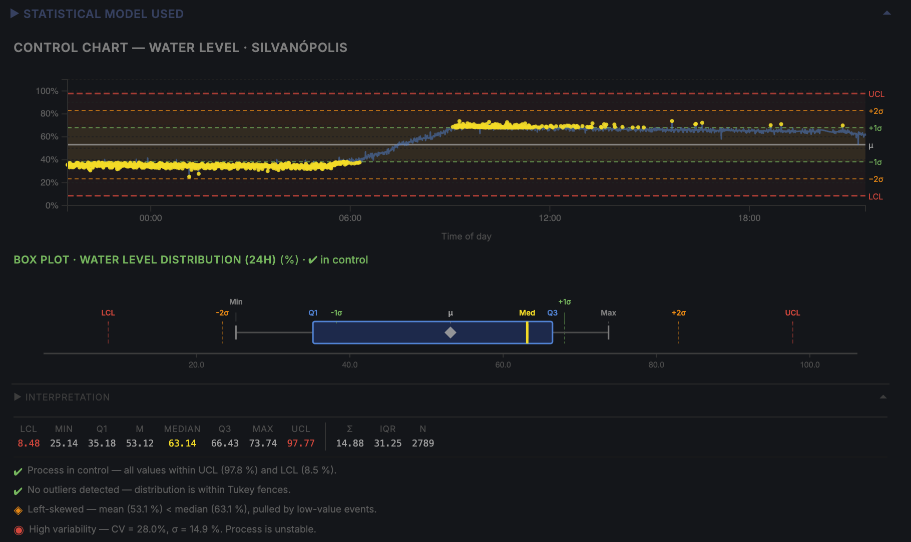

Side-by-side view: the 24-hour **control chart** (top) paired with a horizontal **box plot** showing the statistical distribution of level readings. Labels for Q1, Q3, ±1σ, Min, Max, and UCL/LCL use a greedy multi-row stagger algorithm to prevent overlap on compressed axes.

---

### 📊 Production Bar Chart — 5 Days with Anomaly Alert

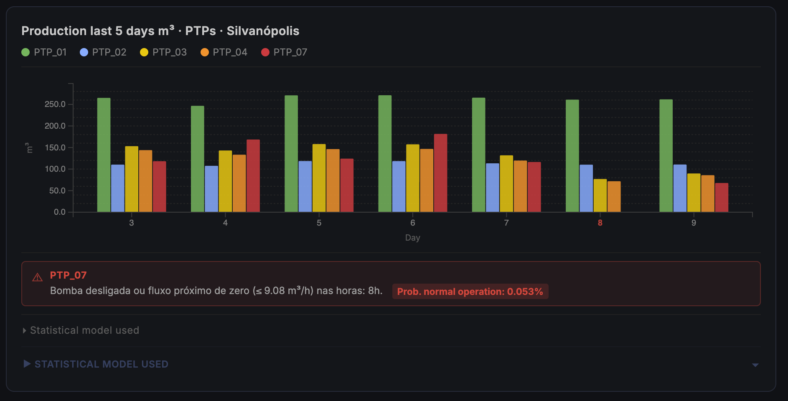

Daily production grouped by pump (PTP_01–PTP_07) for the last 5 days. An automatic anomaly detection alert fires beneath the chart when PTP_07 records near-zero flow (≤ 9.08 m³/h) for 8 consecutive hours — **p = 0.053%** probability of this occurring under normal operating conditions.

---

### 🎛️ Legend Toggle — Isolate Individual Pumps

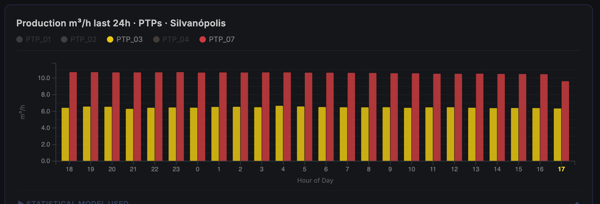

Clicking a legend item toggles its series on or off. The D3 `scaleBand` automatically recalculates bar widths so the remaining bars expand to fill the full group width — no empty gaps.

---

### 🔍 Legend Toggle — Single Series Focus

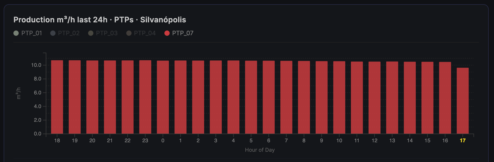

With only PTP_07 selected, the chart renders a clean single-series view. Inactive legend items are dimmed to 28% opacity. Clicking again re-enables the series instantly.

---

### 📐 Box Plot — Daily Production with Interpretation Panel

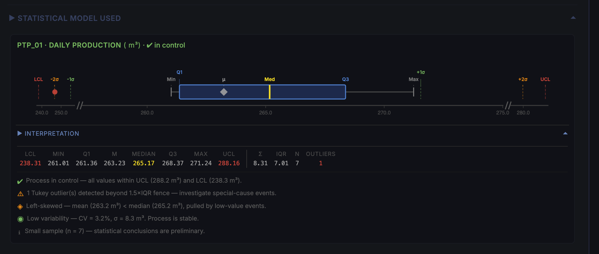

Horizontal box plot for PTP_01 daily production (m³). The **Interpretation** panel below the chart provides automated plain-language analysis: process status (in/out of control), outlier count, skewness direction, and coefficient of variation — formatted for non-technical operators.

---

### 🔬 Box Plot — Interactive Tooltip

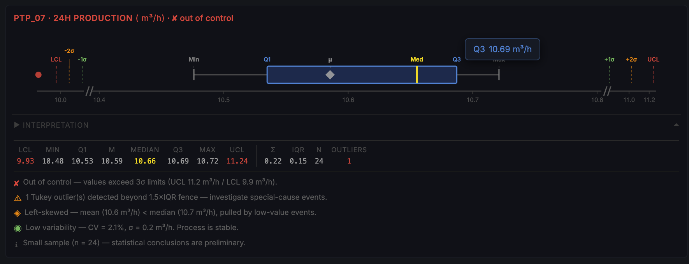

Hover tooltip shows exact values for the nearest statistical marker. Stats strip below the axis displays LCL, Min, Q1, μ, Median, Q3, Max, UCL, Σ, IQR, N, and outlier count at one extra decimal place to distinguish closely-spaced values.

---

### 🧩 Box Plots — Multiple Sensors Side by Side

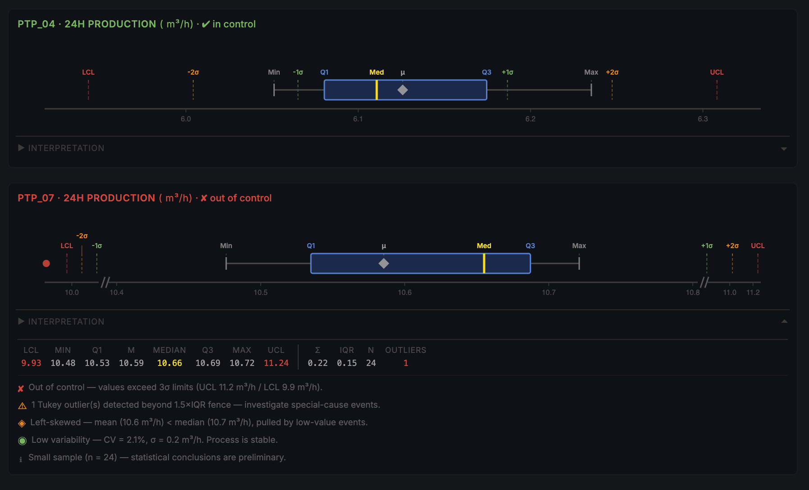

Multiple box plots rendered simultaneously for different pumps. Each plot has a fully independent axis scale using a **piecewise broken-axis** technique — wide outlier gaps are compressed without distorting the main IQR region.

---

### 🧮 Statistical Model — Formulas Reference

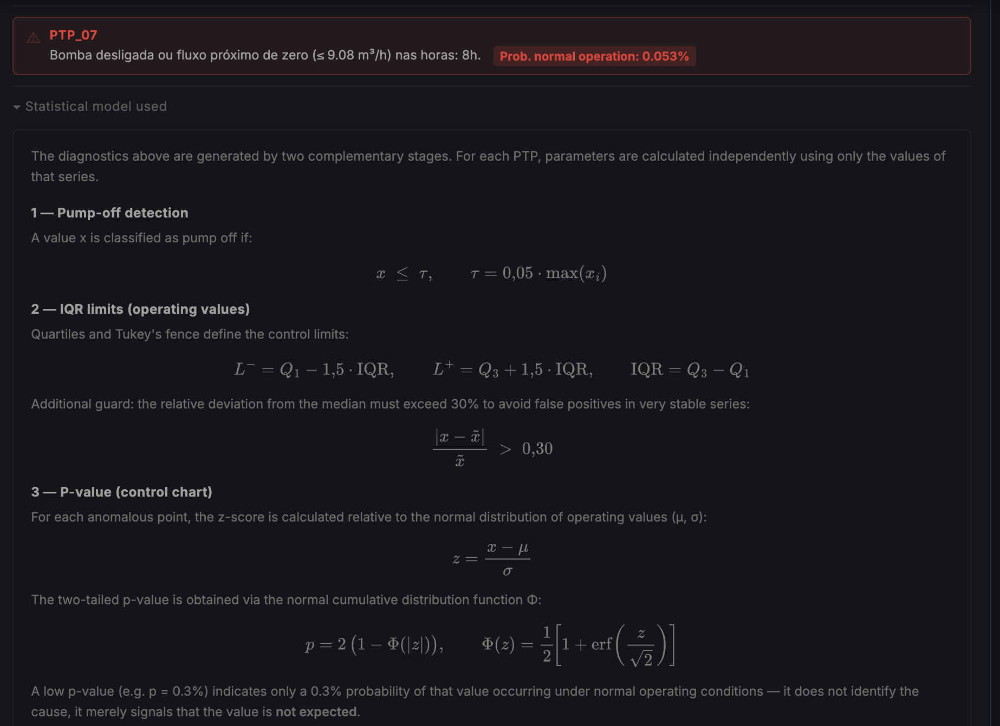

Expandable **Statistical Model Used** panel visible to operators and technical teams. Documents the three detection stages: (1) pump-off threshold τ = 0.05 · max(xᵢ), (2) IQR Tukey fence L⁻/L⁺ with a 30% relative deviation guard, and (3) two-tailed p-value from the normal CDF — all rendered with MathJax-style equations.

---

### 👥 User Activity — Cognito Users & Session Grid

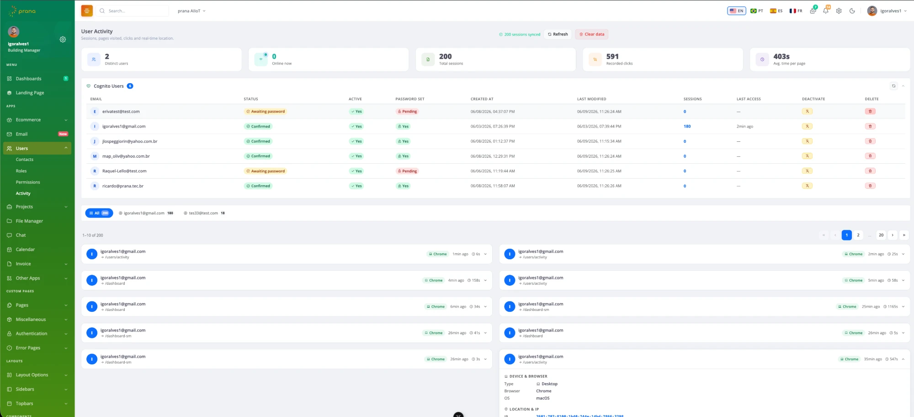

Admin-only panel listing all Cognito users with status, password state, creation/modification timestamps, session counts, and last access time. Inline **Deactivate** and **Delete** actions update the Cognito User Pool directly from the browser using Identity Pool credentials. Below, a paginated 10-per-page session grid shows every page visit across all users.

---

### 🕵️ Session Detail — Device, Location & Click Trail

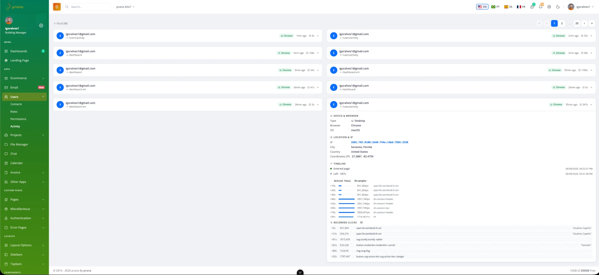

Expanding a session row reveals: device type, browser, OS, geo-resolved IP address (city + country + coordinates), a timeline with entry/exit timestamps, a mouse trail with 55 heat-map samples, and a full click log with element selectors and timestamps — useful for diagnosing UX issues or auditing access patterns.

---

### 🏙️ Main Overview Dashboard — Smart City Summary

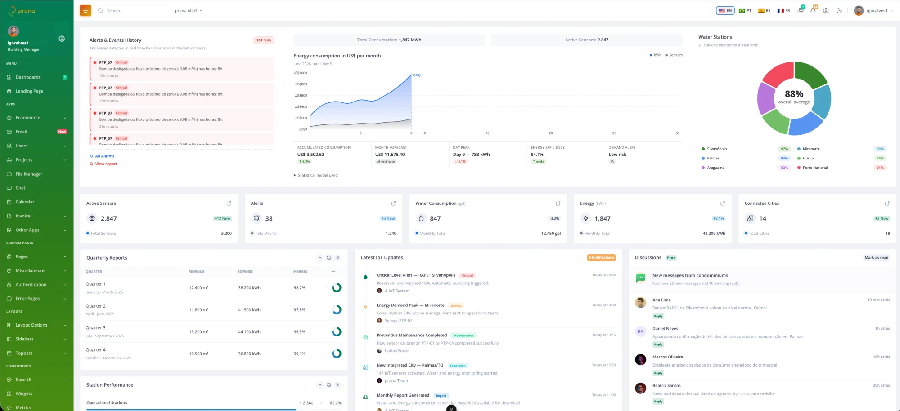

The executive summary dashboard aggregates data across all monitored cities. Stat cards show active sensors (2,847), open alerts (38), water consumption, energy usage, and connected cities (14). The **Alerts & Events History** panel lists real-time IoT anomalies with severity tags. **Water Stations** donut shows per-city fill levels (Silvanópolis 97%, Miranorte 33%).

---

### 🚨 Real-Time Alarms — Live Event Feed

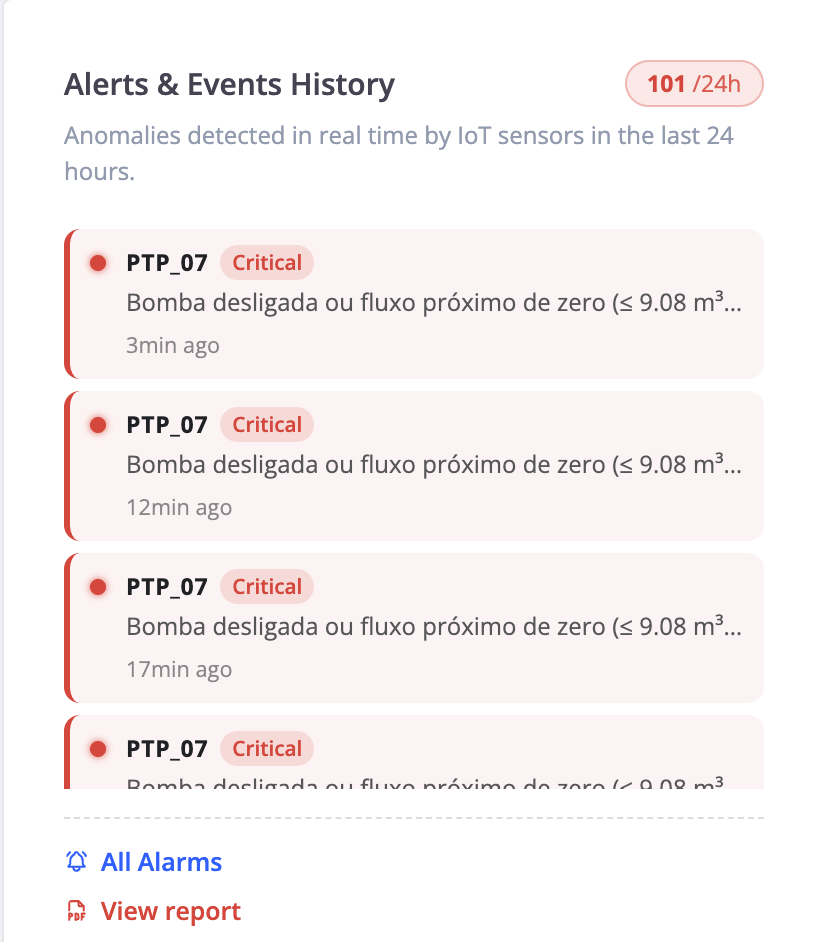

The **Alerts & Events History** widget surfaces anomalies as they occur — 101 events detected in the last 24 hours. Each card shows the affected sensor (PTP_07), severity tag (Critical), a human-readable description of the condition, and how long ago it fired. **All Alarms** and **View report** links provide full drill-down access.

---

### 📄 Alarms & Anomalies Report — Auto-Generated PDF

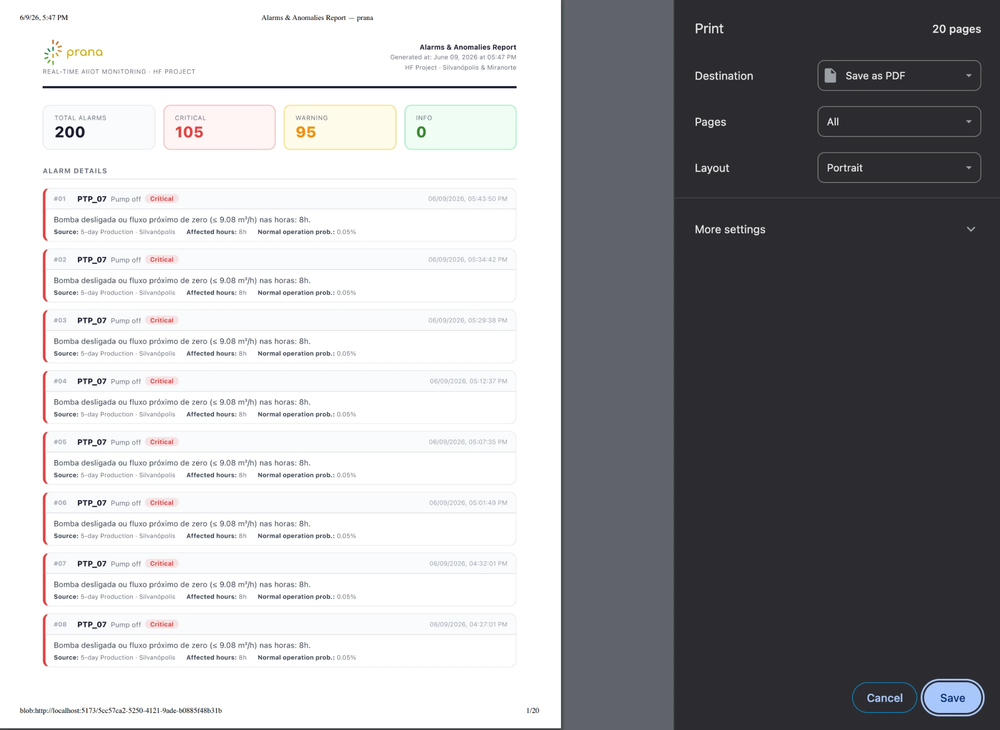

One click on **View report** generates a print-ready **Alarms & Anomalies Report** in the browser — 20 pages, exportable as PDF. The report includes a summary header (Total: 200, Critical: 105, Warning: 95), the prana logo, project metadata, and a numbered alarm log with sensor ID, type, description, source, affected hours, and statistical probability for each event. Fully i18n-aware: renders in the user's selected language.

---

### 👤 Sidebar — User Profile & Navigation

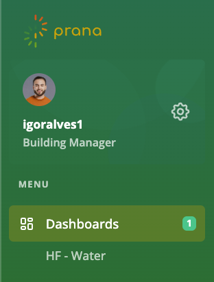

Collapsible sidebar with the prana logo, logged-in user avatar and role, and a minimal navigation menu restricted to the dashboards the user's Cognito group has access to. Role-based visibility is enforced server-side — no client-side route hiding.

---

## Tech Stack

| Layer | Technology |
|---|---|
| Framework | Vue 3 + TypeScript + Vite |
| Charts | D3.js v7 |
| Map | Leaflet + OpenStreetMap |
| Auth | AWS Cognito User Pool (`amazon-cognito-identity-js`) |
| Data | AWS Timestream Query (`@aws-sdk/client-timestream-query`) |
| Credentials | AWS Cognito Identity Pool (`@aws-sdk/credential-provider-cognito-identity`) |
| UI | Bootstrap Vue Next |
| Deploy | GitHub Pages via GitHub Actions |

---

## Architecture

```
Browser
  │
  ├─ Cognito User Pool
  │    └─ Authenticates user, issues 30-min JWT tokens
  │
  ├─ Cognito Identity Pool
  │    └─ Exchanges JWT for temporary AWS credentials (STS)
  │
  └─ Timestream Query (direct browser → AWS, no backend needed)
       ├─ Real-time table  (latest sensor readings)
       ├─ Hourly table     (hourly aggregates)
       └─ Daily table      (daily aggregates)
```

No backend server. No API gateway. Sensor data goes directly from AWS to the browser.

---

## Project Structure

```
src/
├── assets/                  # Static assets (images, styles)
├── components/
│   └── charts/
│       ├── TankGauge.vue        # D3 animated liquid fill gauge
│       ├── LevelTimeSeries.vue  # Time series with thresholds & tooltip
│       ├── FlowTimeSeries.vue   # Multi-line PTP flow chart
│       ├── ProductionBar.vue    # Grouped bar chart (24h / daily)
│       ├── SiteMap.vue          # Leaflet map widget
│       └── RefreshCountdown.vue # D3 countdown arc timer
├── composables/
│   ├── useTimestreamDashboard.ts  # All Timestream queries & data fetching
│   └── useDashboardLogger.ts      # Snapshot logger & JSON export
├── stores/
│   └── auth.ts              # Pinia auth store (Cognito integration)
├── views/
│   ├── auth/                # Login & set-new-password pages
│   └── dashboards/
│       ├── dashboard/       # Main overview dashboard (stat cards, charts)
│       └── dashboard-sm/    # HidroForte SM IoT dashboard
└── router/
    └── index.ts             # Route definitions with silent token refresh
```

---

## Getting Started

### Prerequisites

- Node.js 18+
- AWS account with Cognito User Pool and Timestream configured

### Install & Run

```bash
git clone https://github.com/igoralves1/sm-dashboard-client.git
cd sm-dashboard-client
npm install
npm run dev
```

Open [http://localhost:5173/sm-dashboard-client/](http://localhost:5173/sm-dashboard-client/)

### Environment Variables

Copy `.env.example` to `.env` and fill in your AWS resource identifiers:

```bash
cp .env.example .env
```

All sensitive values are injected at build time via **GitHub Actions Secrets** and never committed to the repository. See `.env.example` for the full list.

```env
# AWS core
VITE_AWS_REGION=
VITE_USER_POOL_ID=
VITE_COGNITO_CLIENT_ID=
VITE_IDENTITY_POOL_ID=

# Timestream database
VITE_TIMESTREAM_DB=
VITE_TIMESTREAM_TABLE_RT=
VITE_TIMESTREAM_TABLE_HOURLY=
VITE_TIMESTREAM_TABLE_DAILY=

# S3 activity bucket
VITE_S3_ACTIVITY_BUCKET=

# Sensor end_id values
VITE_SENSOR_RAP_SIL=
VITE_SENSOR_PTP_01=
VITE_SENSOR_PTP_02=
VITE_SENSOR_PTP_03=
VITE_SENSOR_PTP_04=
VITE_SENSOR_RAP_MIR=
VITE_SENSOR_PTP_07=
```

> **GitHub Secrets:** go to *Settings → Secrets and variables → Actions* and add each variable above as a repository secret. The deploy workflow injects them automatically at build time.

### AWS Profile Setup

```bash
# Configure SSO (one-time setup)
aws configure sso --profile dev-sm

# Login when credentials expire (every 4h)
aws sso login --profile dev-sm
```

The profile auto-loads when you `cd` into this directory via [direnv](https://direnv.net/).

---

## CI/CD Pipeline

Automated build and deployment to GitHub Pages via **GitHub Actions** on every push to the `alle` branch.

```
Push to alle
     │
     ▼
┌──────────────────────┐
│   CI — Build         │  ubuntu-latest / Node.js 20
│                      │
│ 1. Checkout          │
│ 2. npm ci            │  Clean install
│ 3. Inject secrets    │  All VITE_* vars from GitHub Secrets
│ 4. Vite build        │  Secrets baked into /dist at compile time
└─────────┬────────────┘
          │
          ▼
┌──────────────────────┐
│  CD — Deploy         │
│                      │
│ 5. Upload dist       │  actions/upload-pages-artifact
│ 6. Deploy            │  actions/deploy-pages
└──────────────────────┘
          │
          ▼
  https://igoralves1.github.io/sm-dashboard-client/
```

No resource names, table names, sensor IDs, or bucket names are stored in the repository — all are injected from GitHub Secrets at build time.

---

## Authentication Flow

```
1. User visits /login
2. Enters email + password
3. Cognito User Pool authenticates
   ├─ First login → /new-password (forced password change)
   └─ Success    → JWT tokens stored in Pinia (access + id + refresh)
4. Access token valid for 30 minutes
5. On expiry → silent refresh via refresh token
6. On full expiry → redirect to /login
```

---

## Data Sources (AWS Timestream)

| Panel | Table | Measure |
|---|---|---|
| Tank gauge + Level chart | `RT` (real-time) | `water_level` |
| Flow PTPs | `RT` (real-time) | `flux` |
| Production 24h | `HOURLY` | `L_acc` |
| Production daily | `DAILY` | `L_acc` |

---

## Sensor Mapping

Sensor `end_id` values are configured via environment variables.
See `.env.example` for the full list of `VITE_SENSOR_*` variable names.

---

## Alert Intelligence — Six Sigma & Statistical Process Control

### Theory

The alert system is grounded in **Statistical Process Control (SPC)** and the **Six Sigma** methodology — the same framework used in industrial quality control, adapted here to continuous IoT sensor streams.

#### Process Control vs. Control Charts

| Mechanism | Description | Role in Six Sigma |
|---|---|---|
| **Process Control** | The overarching discipline of monitoring and regulating a system to keep it stable and predict future performance | Fifth phase of DMAIC — **Control** |
| **Control Chart** | A graphical tool that tracks process data chronologically to detect shifts, trends, and statistical outliers | Primary tool to distinguish **common cause** from **special cause** variation |

Both are required together: a control chart tells you *whether* a process is stable; process control tells you *what to do* when it isn't.

#### Six Sigma Context

Six Sigma targets **3.4 defects per million opportunities (DPMO)** — near-perfect process reliability. In IoT monitoring:

- **Common cause variation** — normal sensor noise, seasonal fluctuation, expected pump cycling. The system ignores these.
- **Special cause variation** — sudden level drop, abnormal flow spike, pump failure signature. The system alerts on these.

The boundary between the two is defined statistically using **control limits** derived from the process's own historical data, not arbitrary fixed thresholds.

#### Control Chart Formula

For each sensor stream, the system computes a rolling baseline:

```
μ  = mean of recent N observations
σ  = standard deviation of recent N observations

Upper Control Limit (UCL) = μ + 3σ
Lower Control Limit (LCL) = μ − 3σ
```

A data point outside `[LCL, UCL]` is flagged as a **special cause event** — statistically, this occurs by chance only 0.27% of the time under a normal process (one in 370 readings). Any exceedance is treated as a real anomaly requiring attention.

The p-value displayed on the dashboard is the two-tailed probability of observing that value under normal operating conditions, computed from the z-score:

```
z = (x − μ) / σ
p = 2 × (1 − Φ(|z|))
```

Where `Φ` is the standard normal CDF (approximated via the Abramowitz & Stegun error function — no external library required).

A **low p-value** (e.g. `p = 0.3%`) means the reading is highly unlikely under normal process behaviour — it is unexpected, not necessarily dangerous, but worth investigating.

### Application in this platform

| Sensor type | What is monitored | Alert condition |
|---|---|---|
| Reservoir level (RAP) | Water fill % over 24h | Level outside 3σ band OR below critical threshold |
| Pump flow (PTP) | Flow rate m³/h | Rate outside 3σ band (pump off / surge detected) |
| Production hourly | Accumulated volume (L) | Drop vs. expected production curve |

The control limits are recalculated on each data refresh using the most recent 24-hour window, making the system **self-calibrating** — it adapts to seasonal demand patterns, maintenance periods, and gradual infrastructure changes without manual threshold tuning.

### DMAIC Mapping

```
Define   → Sensor streams identified, measurement points mapped (RAP, PTP sensors)
Measure  → Real-time Timestream queries every 5 minutes, 24h rolling window
Analyze  → z-score, p-value, IQR fence computation per sensor
Improve  → Alert surfaced to operator → corrective action taken
Control  → System continuously monitors; 3σ limits auto-updated each cycle
```

> **References:** [ASQ Statistical Process Control Overview](https://asq.org/quality-resources/statistical-process-control) · [Six Sigma Study Guide — Control Charts](https://sixsigmastudyguide.com/control-charts/)

---

## Internationalization (i18n)

The application supports four languages — **English (EN)**, **Portuguese (PT)**, **Spanish (ES)**, and **French (FR)** — powered by [vue-i18n v9](https://vue-i18n.intlify.dev/) in Composition API mode.

### How locale is detected and stored

```
1. First visit
   └─ Calls ipapi.co to detect country by IP
      ├─ Brazil (BR) → PT
      └─ Anywhere else → EN
      Result cached in sessionStorage['prana_geo_v1']

2. User manually switches flag (EN / PT / ES / FR)
   └─ Choice saved to localStorage['prana_locale_v1']
      Persists across browser sessions

3. On every page load
   └─ localStorage checked first → overrides IP detection
```

### Runtime reactivity

```
useLocale() composable
  └─ Module-level ref<Locale> (_locale)
       └─ main.ts watches it → syncs to i18n.global.locale.value
            └─ All t() calls in every component re-run instantly
```

### Locale files

```
src/locales/
├── en.json   ← English (default)
├── pt.json   ← Portuguese
├── es.json   ← Spanish
└── fr.json   ← French
```

All four files share identical key structure. Sections:

| Section | Covers |
|---|---|
| `nav` | Sidebar menu, section headers, user dropdown |
| `topbar` | Search, messages, notifications (all items + timestamps) |
| `login` | Sign-in page copy, feature pills, status bar |
| `new_password` | Forced password change page |
| `dashboard` | Stat cards, charts, alerts, stat model text |
| `monitoring` | Dashboard-SM page — IoT titles, chart labels, thresholds |
| `megamenu` | Top megamenu header and all link items |
| `data` | Timeline events, quarterly reports, project stats |
| `activity` | User activity page — all sections, labels, empty states |

### Adding a new translatable string

1. Add the key to **all four** locale files (`en.json`, `pt.json`, `es.json`, `fr.json`):
```json
// en.json
"my_section": {
  "my_key": "My English text"
}

// pt.json
"my_section": {
  "my_key": "Meu texto em português"
}
```

2. Use `t()` in the Vue component:
```vue
<script setup>
import { useI18n } from 'vue-i18n'
const { t } = useI18n()
</script>

<template>
  <p>{{ t('my_section.my_key') }}</p>
</template>
```

### D3.js charts and locale switching

D3 renders directly to the DOM — Vue template bindings do not apply to SVG text nodes. Every D3 chart that has translatable labels (axis labels, legend text) must redraw on locale change:

```ts
import { useI18n } from 'vue-i18n'
const { t, locale } = useI18n()

function draw() {
  // ...
  svg.append('text').text(t('monitoring.hour_of_day'))  // uses current locale
}

watch(locale, draw)  // redraw when user switches language
```

Components that follow this pattern: `LevelTimeSeries.vue`, `FlowTimeSeries.vue`, `ProductionBar.vue`, `DonutChart.vue`, `StackedAreaChart.vue`.

### Static data arrays with i18n

Arrays defined outside Vue components (e.g. in `data.ts`) cannot call `useI18n()`. Use getter functions that receive `t` as a parameter:

```ts
// data.ts
export function getStatCards(t: (k: string) => string): StatCard[] {
  return [
    { title: t('dashboard.active_sensors_card'), ... },
  ]
}

// component
import { computed } from 'vue'
import { useI18n } from 'vue-i18n'
import { getStatCards } from './data'

const { t } = useI18n()
const statCards = computed(() => getStatCards(t))
// computed re-runs automatically when locale changes
```

### Unit system

The locale also controls the measurement unit system:

| Locale | Water unit | Energy unit |
|---|---|---|
| `en` | `gal` | `kWh` |
| `pt` | `m³` | `kWh` |
| `es` | `gal` | `kWh` |
| `fr` | `gal` | `kWh` |

Keys: `dashboard.water_unit`, `dashboard.energy_unit`.

---

## Security

This is an open-source repository. The frontend code is fully visible by design. However, the AWS backend is protected by multiple layers of automated guardrails — **no human intervention is required for any of them to activate**.

---

### Full security architecture diagram

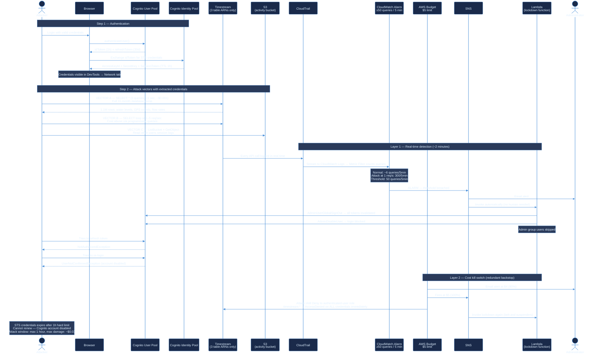

---

### ⚠️ Notice to anyone attempting to misuse this system

The sections below describe in detail what is possible with extracted credentials, the exact token lifetimes, and why automated countermeasures make any attempt futile.

---

### Step 1 — What an attacker can extract from the browser

When a user authenticates, three tokens are issued and stored in `sessionStorage`:

| Token | TTL | Visible in browser? |
|---|---|---|
| `idToken` (Cognito JWT) | **1 hour** | ✅ Yes — Network tab, Authorization header |
| `accessToken` (Cognito JWT) | **1 hour** | ✅ Yes — Network tab |
| `refreshToken` | **30 days** | ✅ Yes — sessionStorage |
| STS `AccessKeyId` + `SecretAccessKey` + `SessionToken` | **1 hour hard limit** | ✅ Yes — Network tab, any HTTP proxy |

The STS credentials are the dangerous ones. They are standard AWS credentials that work outside the browser — in the AWS CLI, any SDK, or any script.

```bash
# What an attacker does after extracting credentials from DevTools:
export AWS_ACCESS_KEY_ID=ASIA...
export AWS_SECRET_ACCESS_KEY=...
export AWS_SESSION_TOKEN=...

aws timestream-query query --query-string "SELECT * FROM ..."
```

---

### Step 2 — Attack surface with extracted credentials

The IAM role assigned to authenticated users is scoped to the minimum required:

| Action | Resource | What the attacker can do | Impact |
|---|---|---|---|
| `timestream:Select` | 3 specific table ARNs only | Read sensor data (water levels, flow rates, GPS coords, device health) | 🟡 Medium — operational IoT data |
| `timestream:DescribeEndpoints` | `*` (AWS SDK requirement) | Resolve the regional endpoint | 🟢 None |
| `s3:PutObject` / `s3:GetObject` | activity bucket only | Read other users' session logs (emails, IPs, pages visited) | 🟡 Medium — privacy |
| `s3:ListBucket` | activity bucket only | List session log filenames | 🟢 Low |
| **Everything else** | — | `AccessDenied` | — |

**What is explicitly blocked:**

- ❌ No write to Timestream
- ❌ No `s3:DeleteObject` (removed)
- ❌ No access to any other S3 bucket in the account
- ❌ No `cognito-idp:ListUsers` (removed from this role)
- ❌ No IAM permissions
- ❌ No access to any other Timestream tables in the database
- ❌ No access to any other AWS service

**Potential attack vectors:**

```
VECTOR A — Data exfiltration (3 queries, < 1 second, cost ~$0.001)
  SELECT * FROM <realtime_table>          → sensor history (months of data)
  SELECT * FROM <hourly_table>            → hourly production aggregates
  SELECT * FROM <daily_table>             → daily production aggregates
  Result: complete database dump in seconds — no way to prevent this

VECTOR B — Cost abuse (SELECT loop, programmatic)
  Run SELECT in a tight loop at 1–5 req/sec using extracted STS keys
  Cost: $0.00038 per full table scan (37.9MB scanned, $0.01/GB)
  At 5 req/sec: theoretical $6.84/hour — kill switch fires before this

VECTOR C — S3 session log read
  ListBucket → enumerate all session files for all users
  GetObject  → read emails, IPs, pages visited, timestamps
  Cannot delete, cannot write to any other bucket
```

---

### Step 3 — Token TTLs and the exploitation window

```
T+0:00   Attacker extracts STS credentials from browser
T+0:00   STS credentials valid — attack begins
T+0:01   CloudTrail logs first Query API call (real-time)
T+0:05   CloudWatch Metric Filter evaluates first 5-min window
T+~2:00  ──► LAYER 1 FIRES if ≥50 queries detected in any 5-min window
              Lockdown Lambda executes:
              • AdminUserGlobalSignOut → refresh token invalidated
              • AdminDisableUser → re-login impossible
T+1:00   STS credentials expire (1-hour hard limit, non-renewable)
         Attacker cannot get new credentials (account disabled)
─────────────────────────────────────────────────────────────────
T+~8h    ──► LAYER 2 FIRES if spend reaches $5
              (AWS Budget checks ~3× per day as a redundant backstop)
              • IAM Deny policy attached → all timestream:* → AccessDenied
              • Lambda fires again (belt and suspenders)
```

**The exploitation window in practice:**

| Attack type | Window before lockdown | Max cost damage |
|---|---|---|
| Data exfiltration (3 queries) | Not stoppable — completes in < 1 second | ~$0.001 |
| Cost abuse loop at 1 req/sec | **~2 minutes** (Layer 1) | ~$0.03 |
| Cost abuse loop at 5 req/sec | **~2 minutes** (Layer 1) | ~$0.03 |
| Slow abuse below alarm threshold | Up to 1 hour (STS TTL) | ~$1.37 max |
| Re-login with same account after TTL | **Impossible** — account disabled | — |

The only vector with no automated prevention is a one-shot data exfiltration (Vector A) — 3 queries completing in under 1 second. The data exposed is IoT water sensor readings from two municipalities — operational data with no personal, financial, or credential information.

---

### Layer 1 — Real-time query rate detection

```
Every Timestream API call
  → AWS CloudTrail — permanent audit log
  → CloudWatch Logs — real-time stream, 30-day retention
  → CloudWatch Metric Filter (TimestreamQueryCount)
  → CloudWatch Alarm evaluates every 5 minutes

Normal app usage    →  ~6 queries per 5-min window  (refresh every 5 min)
Attack at 1 req/sec → 300 queries per 5-min window
Alarm threshold     →  50 queries per 5-min window

On ALARM:
  → SNS topic → Email to administrator
      └─ Lambda (lockdown function)
           ├─ Lists all users in the Cognito User Pool
           ├─ Skips users in 'admin' group (administrator unaffected)
           ├─ AdminUserGlobalSignOut → all refresh tokens invalidated
           └─ AdminDisableUser → accounts locked, re-login impossible
```

---

### Layer 2 — Cost kill switch (redundant backstop)

```
AWS Budget ($5/month limit on Timestream spend)

Spend reaches $4 (80%)  → Email alert to administrator
Spend reaches $5 (100%) → Two simultaneous automated actions:

  Action 1 — IAM Emergency Deny (Budget Action, automatic)
    Attaches emergency deny policy to the authenticated-user IAM role
    Effect: timestream:* → AccessDenied on ALL credentials
    Scope: Cognito pool users only — IoT rules, Grafana, Lambdas unaffected

  Action 2 — SNS → Lambda (same lockdown function as Layer 1)
    AdminUserGlobalSignOut + AdminDisableUser
    Belt-and-suspenders in case Layer 1 was somehow missed
```

---

### What is NOT affected by lockdown

| System | Why unaffected |
|---|---|
| IoT Core sensor ingestion (39 rules) | Uses `aws-iot-rule-*` roles — different IAM entirely |
| Grafana dashboards | Uses its own IAM credentials — different role |
| Scheduled Timestream queries | Uses `RoleTimestreamSchedule` — different role |
| Lambda functions | Each has its own execution role |
| Administrator account | Explicitly skipped by Lambda (`admin` Cognito group check) |
| Other Cognito pools in the account | Lambda scoped to this app's User Pool only |

The lockdown is surgically scoped to credentials issued by this app's Identity Pool — whether used from a browser, AWS CLI, Python script, or any other SDK. Nothing else in the AWS account is interrupted.

---

### Defense infrastructure — itemized monthly cost

This entire security stack runs permanently for **$0.61/month**:

| Component | Unit price | Monthly volume | Monthly cost |
|---|---|---|---|
| AWS CloudTrail trail | Free (first trail/region) | All management events | **$0.00** |
| CloudWatch Logs ingestion | $0.50/GB | ~935MB (IoT rules + Lambda + Timestream events) | **$0.48** |
| CloudWatch Logs storage | $0.03/GB/month | ~935MB × 30-day retention | **$0.03** |
| CloudWatch Metric Filter | Free | 1 filter | **$0.00** |
| CloudWatch Custom Metric | Free (first 10) | 1 metric | **$0.00** |
| CloudWatch Alarm | $0.10/alarm | 1 alarm | **$0.10** |
| SNS notifications | Free (first 1M/month) | < 100/month | **$0.00** |
| Lambda invocations | Free (first 1M/month) | < 10/month | **$0.00** |
| AWS Budget + Budget Action | Free (first 2 budgets) | 1 budget | **$0.00** |
| S3 (CloudTrail logs storage) | $0.023/GB | < 1GB/month | **$0.00** |
| **Total** | | | **$0.61/month** |

**The maximum financial damage an attacker can cause before automated lockdown fires is ~$0.03.** The defense costs more per month than a successful attack.

---

**Attempting to abuse this system is not worth the effort.**

---

## License

This is an open source project licensed under the **Apache 2.0 License**, developed by **Dr. Igor Lemos Alves**.
Free to be used, modified, and distributed by anyone — for commercial or non-commercial purposes.

The `prana` branch is a customization requested by **Prana** — the first client of this platform — to adapt the project to its specific needs (branding, Portuguese copy, client-specific dashboards). The core software itself is brand-agnostic.

---

## References

- [biovisualize.com](https://www.biovisualize.com/) — D3.js visualization patterns and examples
- [Observable](https://observablehq.com/?utm_source=d3js-org&utm_medium=promo&utm_campaign=try-observable) — Interactive D3.js notebooks and chart examples
- [Observable — Trending](https://observablehq.com/trending) — Most popular notebooks right now
- [Observable — Recent](https://observablehq.com/recent) — Latest published notebooks
- [Observable — Top (recent)](https://observablehq.com/top?type=recent) — Top notebooks filtered by recent activity
- [Observable — Top](https://observablehq.com/top) — All-time top notebooks
- [Observable — Resource Center](https://observablehq.com/resource-center) — Tutorials, guides, and learning resources
- [Qualium Systems — Showcase](https://www.qualium-systems.com/showcase/) — Vue.js and frontend showcase examples
- [Piktochart — Big Data Visualization](https://piktochart.com/blog/big-data-visualization/) — Best practices and examples for visualizing large datasets
- [ScienceDirect — Sigma Approach](https://www.sciencedirect.com/topics/computer-science/sigma-approach#chapters-articles) — Academic articles on Six Sigma methodology in computer science
- [Six Sigma Study Guide — Control Phase](https://sixsigmastudyguide.com/control-phase/) — DMAIC Control phase theory and implementation guide
- [Data Syndrome — Box Plot in D3.js](https://blog.datasyndrome.com/a-simple-box-plot-in-d3-dot-js-44e7083c9a9e) — Box plot implementation reference using D3.js
- [Deming Institute — Beginner's Guide to Control Charts](https://deming.org/a-beginners-guide-to-control-charts/) — Foundational concepts of SPC control charts

---
Last updated: 2026-06-10
